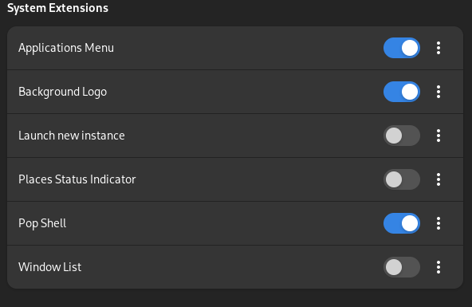

## Setting up Fedora 39 to my liking

### Pop-Shell Tiling Extension

The Pop-Shell tiling extension allows you to speed up your productivity in any Gnome 3 environment. It is responsible for tiling as well as navigating between open windows in a very easy way.

It lets you jump between windows based on where they are located, so <leader-key> + right arrow will move over to the window that is to the right of the current window, etc.

Make sure you have the `Extensions` app downloaded and installed before running any of the following commands.

* Install `gnome-shell-extension-pop-shell`

```bash
sudo dnf install -y gnome-shell-extension-pop-shell
```

* Configure `gnome-shell-extension-pop-shell`

Logout of your current GNOME session.

Log back in.

Open the `Extensions` application on your environment.

Toggle `Pop Shell` in the extensions



* Add pop-shell-shortcuts

Since pop shell has so many different shortcuts, it's a good idea to have a utility called `pop-shell-shortcuts` installed

```bash
sudo dnf install -y make cargo rust gtk3-devel
git clone https://github.com/pop-os/shell-shortcuts /home/$USER/fedora/pop-theme/shell-shortcuts
cd /home/$USER/fedora/pop-theme/shell-shortcuts
make
sudo make install
```

From now on you can type `pop-shell-shortcuts` and a window explaining all shortcuts will appear

### Pop-Shell GTK Theme

The Pop-Shell 

```sudo dnf install -y sassc meson glib2-devel
git clone https://github.com/pop-os/gtk-theme /home/$USER/fedora/pop-theme/gtk-theme
cd /home/$USER/fedora/pop-theme/gtk-theme
meson build && cd build
ninja
sudo ninja install

gsettings set org.gnome.desktop.interface gtk-theme "Pop"bash


```


